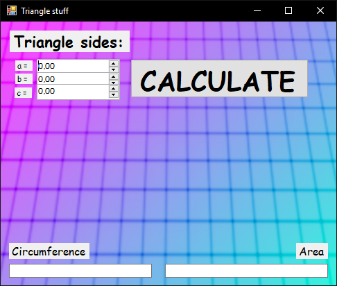
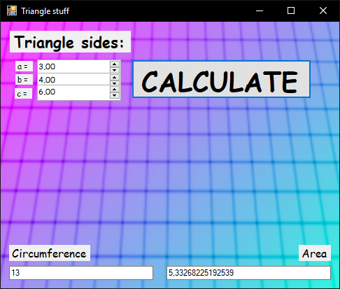
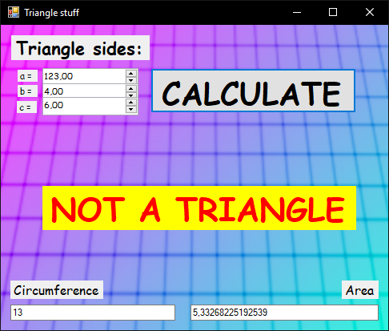

# 【ＲＥＴＲＯ　ＴＲＩＡＮＧＬＥ】

## Why

We were tasked with creating a window application that would calculate the circumference and the area of a triangle based on its sides' lengths.

In WinForms.

So I thought I might as well have some fun with it, and wrap this retro technology into an equally retro ＡＥＳＴＨＥＴＩＣＣ

## Features

1. Calculates the circumference of a triangle based on its sides' lengths
2. Calculates the area of a triangle based on its sides' lengths
3. Is ＡＥＳＴＨＥＴＩＣＣ

## Screenshots

### Base main UI

### Results

### Error

